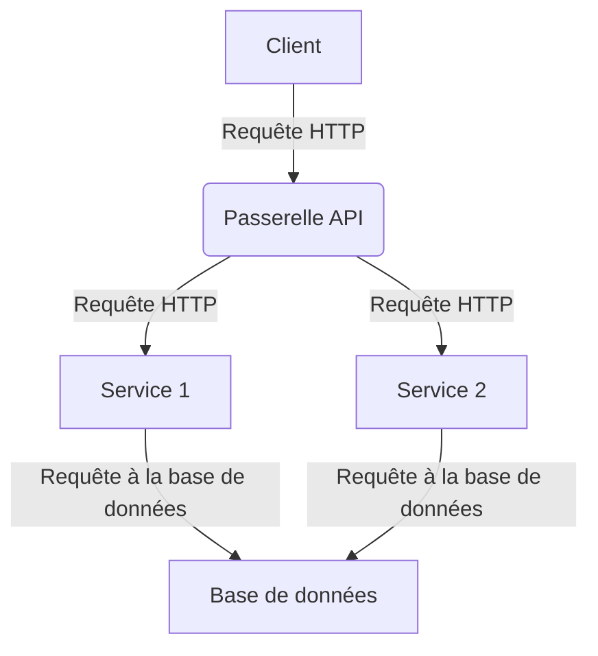

# 🤖 DEV ChatGPT Stimuli

Bienvenue dans ma collection personnelle de stimuli ChatGPT pour les développeurs ! 🙌

Ce dépôt contient une liste de stimuli ChatGPT puissants qui peuvent vous aider à faire circuler vos idées créatives. 💡 Que vous soyez débutant ou professionnel expérimenté, ces stimuli peuvent vous aider à penser en dehors des sentiers battus et à trouver de nouvelles solutions aux problèmes. 🚀

La liste est divisée en catégories : [stimuli pour les codeurs, les étudiants, les spécialistes du marketing et les rédacteurs de contenu]. Ainsi, peu importe votre profession, il y a quelque chose ici pour tout le monde ! 😊 Plongeons directement dans ces puissants stimuli ChatGPT qui peuvent vous aider à élever votre créativité au niveau supérieur ! 🌊

## Table des matières

Prompts pour les codeurs

- [🚩 Conseils](#-conseils)
- [🔗 Approche multi-prompts (Chaining de prompts)](#-approche-multi-prompts-chaining-de-prompts)
  - [1. Moderniser et ajouter les meilleures pratiques](#1-moderniser-et-ajouter-les-meilleures-pratiques)
  - [2. Examiner votre code pour les erreurs logiques et les problèmes de sécurité](#2-examiner-votre-code-pour-les-erreurs-logiques-et-les-problèmes-de-sécurité)
  - [3. Valider les recommandations (réflexion)](#3-valider-les-recommandations-réflexion)
  - [4. Écrire le code](#4-écrire-le-code)
  - [5. Créer des tests](#5-créer-des-tests)
- [Prompt de réécriture](#prompt-de-réécriture)
- [Optimiseur de prompt ChatGPT](#optimiseur-de-prompt-chatgpt)
- [Demander des alternatives](#demander-des-alternatives)
- [Documentation / Explication](#documentation--explication)
  - [📣 Ajouter de la documentation](#-ajouter-de-la-documentation)
  - [📣 Écrire vos termes et conditions](#-écrire-vos-termes-et-conditions)
  - [📣 Produire des fiches de triche](#-produire-des-fiches-de-triche)
  - [📣 Générer des fichiers Readme](#-générer-des-fichiers-readme)
  - [📣 Écrire des blogs détaillés](#-écrire-des-blogs-détaillés)
  - [📣 Expliquer le code](#-expliquer-le-code)
  - [📣 Diagramme d'architecture (Mermaid)](#-diagramme-darchitecture-mermaid)
  - [📣 Diagramme de relation d'entités (Mermaid)](#-diagramme-de-relation-dentités-mermaid)
- [Refactorisation de code](#refactorisation-de-code)
  - [📣 Refactoriser le code](#-refactoriser-le-code)
  - [📣 Moderniser du code ancien](#-moderniser-du-code-ancien)
  - [📣 Diviser le code en plusieurs méthodes](#-diviser-le-code-en-plusieurs-méthodes)
  - [📣 Meilleures performances](#-meilleures-performances)
  - [📣 Ajout d'un paramètre à une fonction](#-ajout-dun-paramètre-à-une-fonction)
  - [📣 Ajout de bonnes pratiques ou principes de codage](#-ajout-de-bonnes-pratiques-ou-principes-de-codage)
  - [📣 Suivre les directives de style de codage](#-suivre-les-directives-de-style-de-codage)
  - [📣 Détection et correction d'erreurs](#-détection-et-correction-derreurs)
  - [📣 Déboguer un composant React](#-déboguer-un-composant-react)
  - [📣 Créer des tests unitaires](#-créer-des-tests-unitaires)
  - [📣 Transpiler du code](#-transpiler-du-code)
  - [📣 Conception responsive](#-conception-responsive)
  - [📣 Internationalisation](#-internationalisation)
  - [📣 Ajouter des commentaires au code](#-ajouter-des-commentaires-au-code)
- [Génération de code](#génération-de-code)
  - [📣 Créer des fonctions](#-créer-des-fonctions)
  - [📣 Générer un Dockerfile](#-générer-un-dockerfile)
  - [📣 Écrire une expression régulière](#-écrire-une-expression-régulière)
  - [📣 Créer une classe](#-créer-une-classe)
  - [📣 Ajouter une fonctionnalité](#-ajouter-une-fonctionnalité)
  - [📣 Créer du code d'amorçage](#-créer-du-code-damorçage)
  - [📣 Vous êtes un ingénieur logiciel de classe mondiale](#-vous-êtes-un-ingénieur-logiciel-de-classe-mondiale)
- [Revue de code](#revue-de-code)
  - [📣 Gestion des erreurs](#-gestion-des-erreurs)
  - [📣 Suggérer des améliorations](#-suggérer-des-améliorations)
- [Promotion de services et de produits](#promotion-de-services-et-de-produits)
  - [📣 Générer des idées de produits innovantes](#-générer-des-idées-de-produits-innovantes)
  - [📣 Développer une proposition de valeur unique](#-développer-une-proposition-de-valeur-unique)
  - [📣 Maîtriser l'art du storytelling pour le marketing](#-maîtriser-lart-du-storytelling-pour-le-marketing)
  - [📣 Créer un programme de parrainage réussi](#-créer-un-programme-de-parrainage-réussi)
  - [📣 Maîtriser l'art de la vente incitative et croisée](#-maîtriser-lart-de-la-vente-incitative-et-croisée)
  - [📣 Créer une campagne marketing virale](#-créer-une-campagne-marketing-virale)
  - [📣 Développer un pitch d'ascenseur puissant](#-développer-un-pitch-dascenseur-puissant)
  - [📣 Créer un plan marketing concret](#-créer-un-plan-marketing-concret)
  - [📣 Tirer parti du marketing de contenu pour la génération de leads](#-tirer-parti-du-marketing-de-contenu-pour-la-génération-de-leads)

## 🚩 Conseils

Comme beaucoup de choses dans la vie, avec GPT-4, vous obtenez ce que vous mettez. Dans ce cas, fournir plus de contexte, d'instructions et de conseils produira généralement de meilleurs résultats.

Voici quelques conseils et techniques pour améliorer :

- **Divisez vos requêtes :**
Essayez de diviser vos requêtes et vos objectifs souhaités en plusieurs étapes. Le fait de garder les requêtes pour un seul résultat a montré qu'il produisait de meilleurs résultats que les requêtes combinées. Par exemple, demandez une révision, puis demandez une refonte basée sur la réponse à la révision. Cela peut devenir moins important avec le temps alors que les LLMs augmentent leur limite de jetons.

- **Donnez des exemples :**
Fournissez des entrées, des données et des sorties attendues pour améliorer la qualité de précision. 📝

- **Soyez spécifique :**
N'ayez pas peur de lister exactement ce que vous voulez, ce que vous savez, ce qui est nécessaire et ce qu'il ne faut pas inclure. 🔎

- **Demandez-lui de réfléchir :**
Une technique appelée réflexion a montré qu'elle augmentait la précision de GPT-4. En gros, demandez-lui "Pourquoi avais-tu tort ?" ou demandez-lui de réfléchir et de revoir sa propre réponse. 🤔

## 🔗 Une approche multi-prompt (chaine de prompts)

peut être utilisée pour mettre à jour, refactoriser et passer en revue un morceau de code. Un ensemble de prompts bien conçu est celui où chacun a des préoccupations séparées et des responsabilités uniques.

### 1. Modernisez et ajoutez les meilleures pratiques

---

en demandant à GPT-4 de réécrire votre code dans le style que vous souhaitez. Cette étape aboutira généralement à une sortie cohérente, dans le style que vous souhaitez, mais peut introduire des erreurs, c'est pourquoi nous le faisons en premier.

**Prompt:**

```
Revoyez le code suivant et réécrivez-le aux normes et au formatage de programmation modernes es6 :

[insérer le code ici]
```

### 2. Revoyez votre code pour les erreurs logiques et les problèmes de sécurité

---

Obtenez des recommandations pour améliorer les erreurs logiques ou de sécurité éventuellement introduites. Il est important de ne pas demander de refactorisation, mais seulement le raisonnement derrière la volonté de la refactorisation.

**Prompt:**

```
Revoyez votre code fourni 'tempFunction' pour identifier les erreurs logiques ou de sécurité éventuelles et fournissez une liste de recommandations.
```

### 3. Validez les recommandations (réflexion)

---

Validez les recommandations fournies. La réflexion est une technique puissante pour améliorer la précision des recommandations initiales et tenter d'éliminer toute hallucination. Ce n'est pas toujours nécessaire, mais il vaut la peine de demander si vous n'êtes pas sûr de certaines recommandations.

**Prompt:**

```
Revoyez vos recommandations ci-dessus. Dites-moi pourquoi vous aviez tort et si des recommandations ont été négligées ou ajoutées de manière incorrecte ?
```

### 4. Écrivez le code

---

Combinez vos revues, recommandations et commentaires pour demander à GPT-4 d'écrire votre nouvelle fonction.

**Prompt:**

```
Réécrivez la fonction 'tempFunction' en fonction de votre revue et de vos recommandations.
```

### 5. Créez des tests

---

Créez quelques tests simples que nous pouvons exécuter localement et valider les résultats.

**Prompt:**

```
Créez deux tests [définir la technologie] pour la fonction 'tempFunction' ci-dessus. Un qui est censé passer et un qui est censé échouer.
```

## Prompt de réécriture

Voyons si nous pouvons obtenir que GPT4 transforme ou moyenne les prompts et les transforme en prompts de type "voyage inspirant".

**Prompt:**

```
[votre prompt]

Réécrivez le texte ci-dessus pour être plus verbeux et inclure beaucoup de descriptions superflues sur chaque élément, utilisez un langage très pictural.
```

## Optimiseur de prompts ChatGPT

**Prompt :**

```
Je vais fournir un prompt ChatGPT. Vous poserez des questions pour comprendre le public et les objectifs, puis optimiserez le prompt pour l'efficacité et la pertinence en utilisant le principe de spécificité.
```

<sup>[⬆️ Retour au tableau des matières](#table-of-contents)</sup>

## Demander des alternatives

Si vous n'êtes pas satisfait de votre solution, vous pouvez demander à ChatGPT de vous donner des alternatives.

**Prompt :**

```
Je vais vous fournir un morceau de code que j'ai écrit et
Je besoin que vous me donniez des alternatives pour faire la même chose d'une autre manière :

[INSÉREZ VOTRE CODE ICI]
```

<sup>[⬆️ Retour au tableau des matières](#table-of-contents)</sup>

---

## Documentation / Explication

### 📣 Ajouter de la documentation

> [!NOTE]
> Ajouter de la documentation nécessite de créer des explications claires et complètes sur le but, la conception et la mise en œuvre d'un module.

Prompt 1# :

```
Je ne sais pas comment coder, mais je veux comprendre comment cela fonctionne. Expliquez-moi le code suivant de manière à ce qu'une personne non technique puisse comprendre. Utilisez toujours Markdown avec un formatage agréable pour faciliter le suivi. Organisez-le par sections avec des en-têtes. Incluez des références au code sous forme de blocs de code markdown dans chaque section. Le code :

[insérer le code ici]
```

Prompt 2# :

```
Veuillez ajouter une documentation complète pour [nom du fichier ou du module], comprenant des explications claires et concises de son but, de sa conception et de sa mise en œuvre. Envisagez d'inclure des exemples d'utilisation du module, ainsi que des diagrammes ou des organigrammes pertinents pour aider à illustrer son fonctionnement. Assurez-vous que la documentation est facilement accessible aux autres développeurs et est mise à jour lorsque le module évolue. Envisagez d'utiliser des outils de documentation tels que des commentaires intégrés, des fichiers markdown ou un générateur de documentation pour simplifier le processus.

[insérer le code ici]
```

<sup>[⬆️ Retour au tableau des matières](#table-of-contents)</sup>

### 📣 Rédigez vos conditions générales

**Prompt :**

```
Créez des termes et conditions pour mon site Web à propos d'un [outil IA] appelé [nom].
```

<sup>[⬆️ Retour au tableau des matières](#table-of-contents)</sup>

### 📣 Produire des fiches de triche

**Prompt :**

```
Rédigez une fiche de triche pour [formatage Markdown].
```

<sup>[⬆️ Retour au tableau des matières](#table-of-contents)</sup>

### 📣 Générer des fichiers Readme

**Prompt :**

```
Générer une documentation pour le code ci-dessous. Vous devez inclure des instructions détaillées pour permettre à un développeur de l'exécuter sur une machine locale, expliquer ce que fait le code et répertorier les vulnérabilités existantes dans ce code.

[entrez le code]
```

<sup>[⬆️ Retour au tableau des matières](#table-of-contents)</sup>

### 📣 Rédiger des blogs détaillés

**Prompt :**

```
Rédigez un blog détaillé sur la construction d'un [traceur COVID] en utilisant React avec une structuration appropriée du code.
```

<sup>[⬆️ Retour au tableau des matières](#table-of-contents)</sup>

### 📣 Expliquer le code

> [!NOTE]
> Ne perdez pas de temps à essayer de comprendre comment fonctionne le code, demandez simplement à ChatGPT de vous l'expliquer

**Prompt :**

```
Contexte : Je commence un nouveau poste de développeur backend et je dois commencer à comprendre comment certaines fonctions fonctionnent
Technologies : [INSÉREZ VOS TECHNOLOGIES ICI]
Vous devez : m'expliquer le code ligne par ligne

[INSÉREZ VOTRE CODE ICI]
```

<sup>[⬆️ Retour au tableau des matières](#table-of-contents)</sup>

### 📣 Diagramme d'architecture (Mermaid)

> [!NOTE]
> Créez un diagramme de votre architecture en utilisant Mermaid

**Prompt :**

```
Écrivez le code Mermaid pour un diagramme d'architecture de cette solution [DÉCRIRE LA SOLUTION]
```

Exemple :



<sup>[⬆️ Retour au tableau des matières](#table-of-contents)</sup>

### 📣 Diagramme d'entité-relation (Mermaid)

> [!NOTE]
> Créez un diagramme d'entité-relation en utilisant Mermaid

**Invite :**

```
Écrivez le code Mermaid pour un diagramme d'entité-relation pour ces classes [INSÉREZ LES CLASSES]
```

<sup>[⬆️ Retour au sommaire](#table-of-contents)</sup>

## Refactoring du code

### 📣 Refactoriser le code

> [!NOTE]
> Demandez à ChatGPT de refactoriser votre code

**Invite :**

```
J'ai un morceau de code et j'ai besoin que vous le refactorisiez :

[INSÉREZ VOTRE CODE ICI]
```

Le refactoring du code est un processus essentiel dans le développement logiciel qui vise à améliorer la qualité, la lisibilité et la maintenabilité du code existant sans en altérer la fonctionnalité. Le refactoring peut améliorer l'efficacité du code, réduire les erreurs et faciliter sa modification ou son extension à l'avenir. Avec l'aide de ChatGPT, vous pouvez refactoriser efficacement votre code et obtenir une meilleure structure de code.

<sup>[⬆️ Retour au sommaire](#table-of-contents)</sup>

### 📣 Moderniser un vieux code

> [!NOTE]
> En fournissant votre ancienne fonction à GPT-4 et en lui demandant de le refactoriser selon les pratiques de codage modernes, vous pouvez rapidement moderniser votre code.

**Invite :**

```
Refactorisez le code suivant selon les normes de programmation es6 modernes :

[INSÉREZ VOTRE CODE ICI]
```

<sup>[⬆️ Retour au sommaire](#table-of-contents)</sup>

### 📣 Code en plusieurs méthodes

> [!NOTE]
> Si vous avez une longue fonction qui fait trop de choses, vous pouvez demander à GPT-4 de la refactoriser en plusieurs méthodes.

**Invite :**

```
Refactorisez le code suivant en plusieurs méthodes pour améliorer la lisibilité et la maintenabilité :

[INSÉREZ VOTRE CODE ICI]
```

<sup>[⬆️ Retour au sommaire](#table-of-contents)</sup>

### 📣 Meilleures performances

> [!NOTE]
> Si vous avez une fonction qui prend trop de temps à s'exécuter, vous pouvez demander à GPT-4 de la refactoriser pour améliorer les performances.

**Invite :**

```
Refactorisez le code suivant pour améliorer les performances :

[INSÉREZ VOTRE CODE ICI]
```

<sup>[⬆️ Retour au sommaire](#table-of-contents)</sup>

### 📣 Ajouter un paramètre à une fonction

**Invite :**

```
Ajoutez un paramètre à cette fonction pour effectuer [FONCTIONNALITÉ]

[INSÉREZ VOTRE CODE ICI]
```

<sup>[⬆️ Retour au sommaire](#table-of-contents)</sup>

### 📣 Ajouter des bonnes pratiques ou principes de codage

> [!NOTE]
> Laissez ChatGPT réécrire le code pour vous selon les directives de style.

**Invite :**

```
Réécrivez le code ci-dessous en suivant les directives de style de Google pour JavaScript.

[INSÉREZ VOTRE CODE ICI]
```

<sup>[⬆️ Retour au sommaire](#table-of-contents)</sup>

### 📣 Suivre les directives de style de codage

> [!NOTE]
> Si votre organisation ou votre base de code utilise des pratiques et des styles de codage spécifiques que vous souhaitez maintenir, vous pouvez fournir des instructions à GPT-4 sur la pratique ou le style de codage particulier sur lequel vous souhaitez qu'il se concentre.

**Invite :**

```
Examinez le code suivant et refactorisez-le pour le rendre plus DRY et adoptez les principes de programmation SOLID.

[INSÉREZ VOTRE CODE ICI]
```

<sup>[⬆️ Retour au sommaire](#table-of-contents)</sup>

### 📣 Détection et correction des erreurs

> [!NOTE]
> Parfois, nous ne sommes pas conscients des vulnérabilités ou des problèmes potentiels que notre code peut créer. Faire examiner et corriger les problèmes de code par GPT-4 peut vous faire gagner plus que du temps.

**Prompt 1# :**

```
Examinez ce code pour les erreurs et refactorisez-le pour corriger tout problème :

[INSÉREZ VOTRE CODE ICI]
```

**Prompt 2# :**

```
Je développe un logiciel en [INSÉREZ VOS TECHNOLOGIES ICI] et j'ai besoin de votre aide pour trouver et
corriger toutes les erreurs dans mon code, en suivant les meilleures pratiques. Je vous fournirai mon code
et vous me fournirez le code avec toutes les corrections expliquées ligne par ligne
```

**Prompt 3# :**

```
J'ai écrit ce code [CODE] et j'ai obtenu cette erreur [ERREUR]. Comment puis-je la corriger ? ou Que signifie cette erreur ?
```

<sup>[⬆️ Retour au sommaire](#table-of-contents)</sup>

### 📣 Déboguer un composant React

> [!NOTE]
> Ce processus implique généralement d'identifier la source de l'erreur, de comprendre le problème et de mettre en œuvre une solution pour le résoudre.

**Invite :**

```
Veuillez trouver et corriger le bogue dans le composant [nom du composant] qui provoque [décrire le problème].

[INSÉREZ VOTRE CODE ICI]
```

<sup>[⬆️ Retour au sommaire](#table-of-contents)</sup>

### 📣 Créer des tests unitaires

> [!NOTE]
> Les tests unitaires sont des tests automatisés qui vérifient le comportement des unités individuelles de code de manière isolée. Ils aident à détecter les bugs tôt et facilitent la maintenance du code.

**Instructions 1#:**

```
Veuillez écrire des tests unitaires pour [nom du fichier ou du module] pour garantir son bon fonctionnement.

[insérer le code ici]
```

**Instructions 2#:**

```
Créez 2 tests unitaires pour le code fourni. Un pour une condition de réussite et un pour un échec.
```

<sup>[⬆️ Retour au sommaire](#table-of-contents)</sup>

### 📣 Transpiler du code

> [!NOTE]
> Il existe de nombreuses raisons pour lesquelles vous pourriez avoir besoin de convertir du code d'un langage à un autre. Par exemple, vous avez peut-être trouvé un dépôt avec du code dans un langage dont vous avez besoin dans un autre, vous déplacez des bases de code, ou peut-être que votre patron a lu un article sur le dernier framework front-end et maintenant vous passez à une nouvelle bibliothèque controversée.

**Instructions :**

```
Réécrivez le code suivant en Rust :

[INSÉREZ VOTRE CODE ICI]
```

<sup>[⬆️ Retour au sommaire](#table-of-contents)</sup>

### 📣 Conception adaptative

> [!NOTE]
> La conception adaptative adapte un site Web à différentes tailles d'écran et appareils, en utilisant des mises en page flexibles, des images et des requêtes CSS media. Elle vise à offrir une bonne expérience de visualisation à tous les utilisateurs.

**Instructions :**

```
Implémentez la conception adaptative pour le composant [nom du composant] afin de garantir qu'il ait l'air et fonctionne correctement sur différentes tailles d'écran et appareils. Envisagez d'utiliser [technique ou bibliothèque de conception adaptative] pour y parvenir.

[insérer le code ici]
```

<sup>[⬆️ Retour au sommaire](#table-of-contents)</sup>

### 📣 Internationalisation

> [!NOTE]
> L'internationalisation, également connue sous le nom d'i18n, est le processus de conception d'une application logicielle pour qu'elle puisse prendre en charge plusieurs langues et différences régionales.

**Instructions :**

```
Implémentez l'internationalisation pour le composant [nom du composant] afin de garantir qu'il puisse être utilisé par des utilisateurs dans plusieurs langues. Envisagez d'utiliser [bibliothèque ou technique d'internationalisation] pour y parvenir.
```

<sup>[⬆️ Retour au sommaire](#table-of-contents)</sup>

### 📣 Ajouter des commentaires au code

> [!NOTE]
> Si votre code est auto-explicatif mais nécessite des commentaires, cela peut vous faire gagner beaucoup de temps.

**Instructions :**

```
Ajoutez des commentaires au code suivant :

[INSÉREZ VOTRE CODE ICI]
```

<sup>[⬆️ Retour au sommaire](#table-of-contents)</sup>

## Génération de code

### 📣 Créer des fonctions

> [!NOTE]
> Fournissez le contexte de votre logiciel et demandez directement de créer les fonctions dont vous avez besoin pour votre logiciel.

**Instructions :**

```
Contexte : Je crée un logiciel pour gérer des projets

Technologies : Go, PostgreSQL

Description : C'est une fonction qui me permet de trouver des utilisateurs par leur adresse e-mail ou leur nom d'utilisateur.

Vous devez : créer la fonction pour moi
```

Vous pouvez également ajouter dans la description ce que vous attendez de votre fonction. Si vous avez déjà une structure pour l'utilisateur, spécifiez-la, par exemple :

**Instructions :**

```
Contexte : Je crée un logiciel pour gérer des projets

Technologies : Go, PostgreSQL

Description : C'est une fonction qui me permet de trouver des utilisateurs par leur adresse e-mail ou leur nom d'utilisateur et renvoie le type de structure "Membre".

Vous devez : créer la fonction pour moi
```

<sup>[⬆️ Retour au sommaire](#table-of-contents)</sup>

### 📣 Générer un Dockerfile

> [!NOTE]
> Une invite pour générer un Dockerfile pour un framework spécifique.

**Instructions :**

```
Écrivez un Dockerfile pour :

[FRAMEWORK]
```

<sup>[⬆️ Retour au sommaire](#table-of-contents)</sup>

### 📣 Écrire une expression régulière

**Instructions :**

```
Écrivez une expression régulière qui correspond à / Écrivez un motif RegEx pour :

[Demande]
```

<sup>[⬆️ Retour au sommaire](#table-of-contents)</sup>

### 📣 Créer une classe

**Instructions :**

```
Créez une classe [PLATFORM] à partir de cet objet JSON

[JSON]
```

<sup>[⬆️ Retour au sommaire](#table-of-contents)</sup>

### 📣 Ajouter des fonctionnalités

**Instructions :**

```
J'ai besoin d'un morceau de code en [INSÉREZ VOS TECHNOLOGIES ICI] pour implémenter [communication en temps réel]
```

<sup>[⬆️ Retour au sommaire](#table-of-contents)</sup>

### 📣 Créer un code d'amorçage

> [!NOTE]
> Démarrer de nouveaux projets peut être douloureux. Bien que GPT-4 ne connaisse pas votre logique métier, il peut être utilisé pour générer un code d'amorçage. Ce n'est pas techniquement du refactoring, mais c'est incroyable et peut faire partie du processus de cycle de vie de la programmation.

**Instructions :**

```
Écrivez-moi une fonction d'amorçage Node.js qui prendra une variable de type Utilisateur, validera que l'utilisateur a les bonnes autorisations, récupérera un tableau de type d'élément Messages d'une base de données postgres et les renverra. Laissez des commentaires pour la logique métier.
```

<sup>[⬆️ Retour au sommaire](#table-of-contents)</sup>

### 📣 Vous êtes un ingénieur logiciel de classe mondiale

> [!NOTE]
> Dans ce clip, je vous montre comment améliorer *radicalement* les

 sorties de ChatGPT pour la génération de logiciels.

**Instructions :**

```
Vous êtes un ingénieur logiciel de classe mondiale.

Je besoin que vous rédigiez une spécification technique logicielle pour construire ce qui suit :
[DESCRIPTION]

Pensez à comment vous le construiriez étape par étape.

Ensuite, répondez avec la spécification complète sous forme d'un fichier markdown bien organisé.

Je répondrai ensuite avec "construire", et vous procéderez à la mise en œuvre exacte de la spécification, en écrivant tout le code nécessaire. Je vais intervenir périodiquement avec "continuer" pour vous inciter à continuer. Continuez jusqu'à ce que ce soit complet.
```

<sup>[⬆️ Retour au sommaire](#table-of-contents)</sup>

## Révision de code

### 📣 Gestion des erreurs

**Instructions :**

```
Comment puis-je améliorer la gestion des erreurs dans mon code [LANGUAGE]? [CODE]
```

<sup>[⬆️ Retour au sommaire](#table-of-contents)</sup>

### 📣 Suggérer des améliorations

**Instructions :**

```
Je travaille sur un projet [LANGUAGE] et j'ai besoin que vous révisiez mon code et que vous suggériez des améliorations. [CODE]
```

<sup>[⬆️ Retour au sommaire](#table-of-contents)</sup>

## Promotion de services produits

### 📣 Générer des idées de produits innovants

**Instructions :**

```
Faites un brainstorming d'idées de produits créatives et uniques pour [insérer l'industrie ou le marché].

Concentrez-vous sur la résolution des problèmes des clients et sur la fourniture de valeur exceptionnelle.
```

<sup>[⬆️ Retour au sommaire](#table-of-contents)</sup>

### 📣 Développer une proposition de valeur unique

**Instructions :**

```
Aidez-moi à articuler une proposition de valeur unique pour mon [insérer produit ou service].

Expliquez comment cette proposition différencie mon offre et attire mon public cible.
```

<sup>[⬆️ Retour au sommaire](#table-of-contents)</sup>

### 📣 Maîtriser l'art du storytelling pour le marketing

**Instructions :**

```
Enseignez-moi des techniques de storytelling pour créer du contenu marketing convaincant afin de promouvoir [insérer produit ou service].
```

<sup>[⬆️ Retour au sommaire](#table-of-contents)</sup>

### 📣 Créer un programme de recommandation réussi

**Instructions :**

```
Concevez un programme de recommandation pour [insérer entreprise] qui incite les clients à partager et à recommander nos produits ou services.
```

<sup>[⬆️ Retour au sommaire](#table-of-contents)</sup>

### 📣 Maîtriser l'art de la vente incitative et croisée

**Instructions :**

```
Enseignez-moi des techniques efficaces de vente incitative et croisée pour augmenter les revenus et la satisfaction des clients dans [insérer le contexte commercial].
```

<sup>[⬆️ Retour au sommaire](#table-of-contents)</sup>

### 📣 Créer une campagne marketing virale

**Instructions :**

```
Concevez une campagne marketing créative et accrocheuse pour [insérer produit ou service] avec le potentiel de devenir virale.
```

<sup>[⬆️ Retour au sommaire](#table-of-contents)</sup>

### 📣 Développer un pitch d'ascenseur puissant

**Instructions :**

```
[Insérez une brève description de votre produit, service ou entreprise].

Aidez-moi à créer un pitch d'ascenseur concis et convaincant qui communiquera efficacement la valeur de mon offre.
```

<sup>[⬆️ Retour au sommaire](#table-of-contents)</sup>

### 📣 Créer un plan marketing actionnable

**Instructions :**

```
Élaborez un plan marketing pour [insérer produit ou service].

Incluez les objectifs, le public cible, les canaux marketing et les tactiques pour atteindre mon public cible et stimuler les ventes.
```

<sup>[⬆️ Retour au sommaire](#table-of-contents)</sup>

### 📣 Exploiter le marketing de contenu pour la génération de leads

**Instructions :**

```
Développez une stratégie de marketing de contenu pour [insérer entreprise] afin d'attirer, d'engager et de convertir les leads en clients.
```

<sup>[⬆️ Retour au sommaire](#table-of-contents)</sup>

<details>

<summary>

## 📚 Outils

</summary>

- [ChatGPT](https://chat.openai.com/)
- [Bard](https://bard.google.com/)

</details>